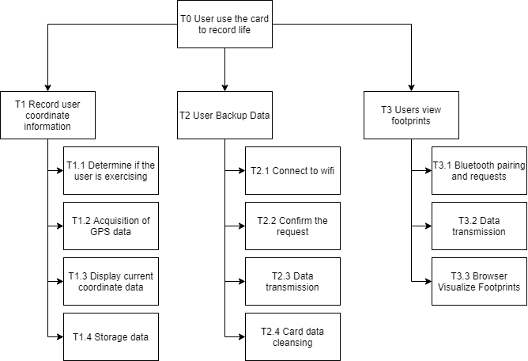

## SSM3: Root definition
### User World View
- The user carries the card on the move (input) and watches their footprint record in the phone (output).
### Smart Device World View
- Smart device detects movement (input), extracts information from GPS module and stores it (output).
- Smart device listen for Bluetooth pairing requests (input) and transmit data (output).
- The smart device detects the Wi-Fi connection (input) and the user presses the button (input) for data backup to the server (output).
### Server World View
- The server detects the smart device request (input) and then accepts the data (input).
- The server detects that the user want to view (input) the data and then transmits the data (output).
### Smartphone World View
- The phone sends a Bluetooth pairing and transmission request (output), then accepts the data (input), and finally opens a browser to render the visualization (Output).
## SSM4: Conceptual modelling
The following Hierarchical Task Analysis (HTA) model describes the different tasks and subtasks that need to be performed to achieve the desired goal.  

## SSM5: Comparison of model and Real World
- T1.1: The appropriate detection interval is chosen for low power consumption in the real world without the need for continuous detection.
- T1.2: Since GPS data callbacks have long time intervals, careful consideration needs to be given to the frequency of reading GPS data.
- T1.3: In reality, the screen doesn't need to be always on, set a rest button to keep the power consumption low.
- T2.1: Choose the way in which the card can passively or automatically connect to the user's network.
## SSM6: Changes of the model
Based on the above comparative analysis with the real world, the final choice was to perform motion detection every 8 seconds to match the interval at which GPS receives satellite data.
