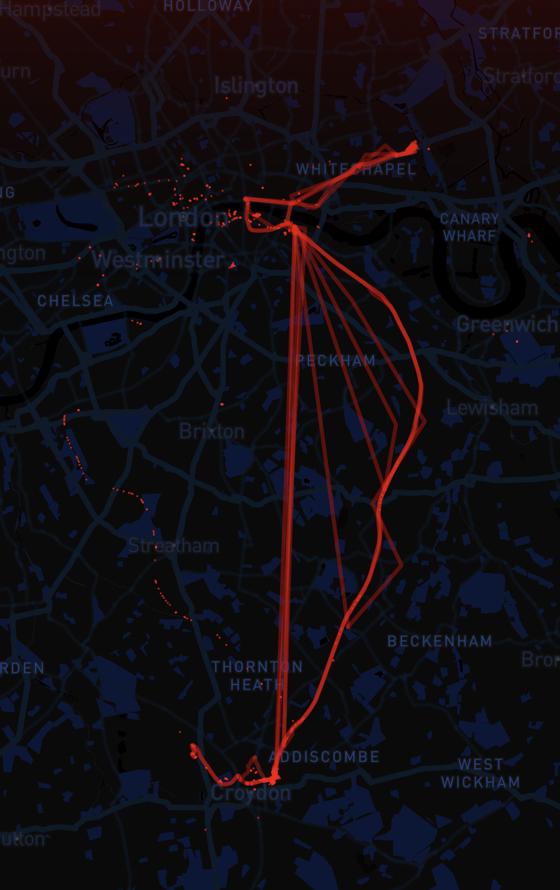

## Recording test
The test was carried out on journeys from Croydon to Queen Mary University of London (My primary route to school) in some day.
- Footprint cards can intermittently record and successfully save location information.
- In some narrow and metro sections, GPS signals cannot be received properly. In addition, signal loss also occurs at certain moments in open areas, and it is assumed that the probable cause is that the GPS signal was extracted at a time when the GPS fix phase was in progress, and that any subsequent time intervals need to be adjusted.
- The range was not tested as there is no corresponding battery design for this project yet.

## Display test
- The storage format is finalized in `csv` format.
- For the time being, third-party software is used for map presentation. Below are screenshots:

>! Due to some testing and debugging, some data points were incorrectly connected, but the approximate path can still be seen.
- It is also possible to import the `csv` into Google Earth for viewing by converting it to `KML` format using an online tool[^1], these will be demonstrated in a later video.

## Shortcomings
- Positioning is easily lost.
- The current Bluetooth connection is cumbersome and inflexible and requires an improved transmission method.
- Sketchy user interface.

## Future action
- Design a new set of UI.
- Optimization of data transfer methods.
- Design a circuit board containing a one-to-three power management module and charging module.
- Design Footprint Card Case.

---
[^1]: https://mygeodata.cloud/converter/