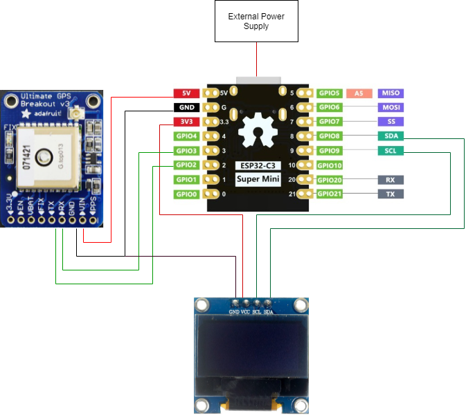

## Hardware development
Since this is a prototype development, in this project a breadboard and an external power supply is used first.
### Proposed model architecture

- The SDA and SCL of the OLED display are connected to the SDA and SCL of the board for I2C serial communication.
- The TX and RX ports of the GPS module are connected to GPIO2 and GPIO3 of the board.
- The board uses USB type C for external power supply.
- The on-board 5 volts powers the GPS module and 3.3 volts powers the OLED display.


## Software development
Since the ESP series development boards support Arduino for programming, they are developed using the Arduino IDE.
### GPS Module and OLED display
Reading the GPS module directly will get its standard language NMEA[^1] (National Marine Electronics Association), which is a standard data format generally supported by manufacturers in the following form:
```
$GPGGA,110617.00,51XX.XXXXX,N,00009.XXXXX,W,1,05,2.68,129.0,M,50.1,M,,*42
$GPGSA,A,3,06,09,30,07,23,,,,,,,,4.43,2.68,3.53*02
$GPGSV,3,1,11,02,48,298,24,03,05,101,24,05,17,292,20,06,71,227,30*7C
$GPGSV,3,2,11,07,47,138,33,09,64,044,28,17,01,199,,19,13,214,*7C
$GPGSV,3,3,11,23,29,054,29,29,01,335,,30,29,167,33*4E
$GPGLL,51XX.XXXXX,N,00009.XXXXX,W,110617.00,A,A*70
$GPRMC,110618.00,A,51XX.XXXXX,N,00009.XXXXX,W,0.078,,030118,,,A*6A 
$GPVTG,,T,,M,0.043,N,0.080,K,A*2C
```
We only need information about the time and location coordinates, and we only need to focus on the GPGGA column at the beginning. Where `110617.00` means 11:06:17 UTC, `51XX.XXXXXX, N` means 51.XXXXXXXX degrees North, `00009.XXXXXX, W` means 0.09XXXXX degrees West.
In this project, the TinyGPSPlus[^2] library and U8g2[^3] library are used for quick development. The base code is as follows:
```C++
#include <Arduino.h>
#include <U8g2lib.h>

#ifdef U8X8_HAVE_HW_SPI
#include <SPI.h>
#endif
#ifdef U8X8_HAVE_HW_I2C
#include <Wire.h>
#endif

#include <TinyGPSPlus.h>
#include <SoftwareSerial.h>

static const int RXPin = 3, TXPin = 2;
static const uint32_t GPSBaud = 4800;

#define time_delay 2000
U8G2_SSD1306_128X64_NONAME_F_HW_I2C u8g2(U8G2_R0, /* reset=*/ U8X8_PIN_NONE, /* clock=*/ 9, /* data=*/ 8); 

// The TinyGPSPlus object
TinyGPSPlus gps;

// The serial connection to the GPS device
SoftwareSerial ss(RXPin, TXPin);

int a;

void setup() {
  u8g2.begin();

  Serial.begin(115200);
  ss.begin(GPSBaud);
  a = 0;
}

void loop() {
  u8g2.sendBuffer();
  u8g2.clearBuffer();
  u8g2_prepare();
  a += 1;
  char b = char(a);
  u8g2.drawStr(80, 0, &b);
  u8g2_GPS_data(gps.location.lat(), gps.location.lng());
  printDateTime(gps.time);
  smartDelay(1000);

  if (millis() > 5000 && gps.charsProcessed() < 10)
    u8g2_No_GPS_data();
  
  u8g2.sendBuffer();
}

static void smartDelay(unsigned long ms)
{
  unsigned long start = millis();
  do 
  {
    while (ss.available())
      gps.encode(ss.read());
  } while (millis() - start < ms);
}

void u8g2_prepare(void) {
  u8g2.setFont(u8g2_font_6x10_tf);
  u8g2.setFontRefHeightExtendedText();
  u8g2.setDrawColor(1);
  u8g2.setFontPosTop();
  u8g2.setFontDirection(0);
}

void u8g2_No_GPS_data() {
  u8g2.drawStr(0, 30, "No GPS data received");
}

void u8g2_GPS_data(float lat, float lng) {
  u8g2.drawStr(0, 0,"Lat: ");
  char buffer1[10];
  dtostrf(lat, 6, 3, buffer1);
  u8g2.drawStr(25,0,buffer1);
  u8g2.drawStr(0, 10,"Lng: ");
  char buffer2[10];
  dtostrf(lng, 6, 3, buffer2);
  u8g2.drawStr(25,10,buffer2);
}

static void printDateTime(TinyGPSTime &t)
{ 
  if (!t.isValid())
  {
    u8g2.drawStr(0, 20,"******");;
  }
  else
  {
    char sz[32];
    sprintf(sz, "%02d:%02d:%02d ", t.hour(), t.minute(), t.second());
    u8g2.drawStr(0, 20,"Time: ");
    u8g2.drawStr(36, 20, sz);
  }
  smartDelay(0);
}
```

### Bluetooth Low Energy
Bluetooth Low Energy (BLE) is an energy-efficient variant of Bluetooth. The main application of BLE is the transmission of small amounts of data over short distances (low bandwidth). Unlike always-on Bluetooth, BLE is always in sleep mode unless a connection is initiated. This makes it consume very low power.
```C++
#include <BLEDevice.h>
#include <BLEUtils.h>
#include <BLEServer.h>

#define SERVICE_UUID        "**************************"
#define CHARACTERISTIC_UUID "**************************"

void setup() {
  Serial.begin(115200);
  Serial.println("Starting BLE");

  BLEDevice::init("Long name works now");
  BLEServer *pServer = BLEDevice::createServer();
  BLEService *pService = pServer->createService(SERVICE_UUID);
  BLECharacteristic *pCharacteristic = pService->createCharacteristic(
                                         CHARACTERISTIC_UUID,
                                         BLECharacteristic::PROPERTY_READ |
                                         BLECharacteristic::PROPERTY_WRITE
                                       );

  pCharacteristic->setValue("Hello World says Neil");
  pService->start();
  BLEAdvertising *pAdvertising = BLEDevice::getAdvertising();
  pAdvertising->addServiceUUID(SERVICE_UUID);
  pAdvertising->setScanResponse(true);
  pAdvertising->setMinPreferred(0x12);
  BLEDevice::startAdvertising();
}

void loop() {

  delay(2000);
}
```

---
[^1]: https://www.nmea.org/
[^2]: https://github.com/mikalhart/TinyGPSPlus
[^3]: https://github.com/olikraus/u8g2