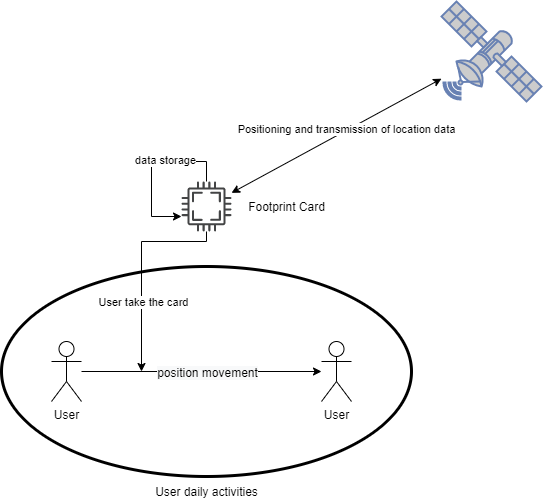
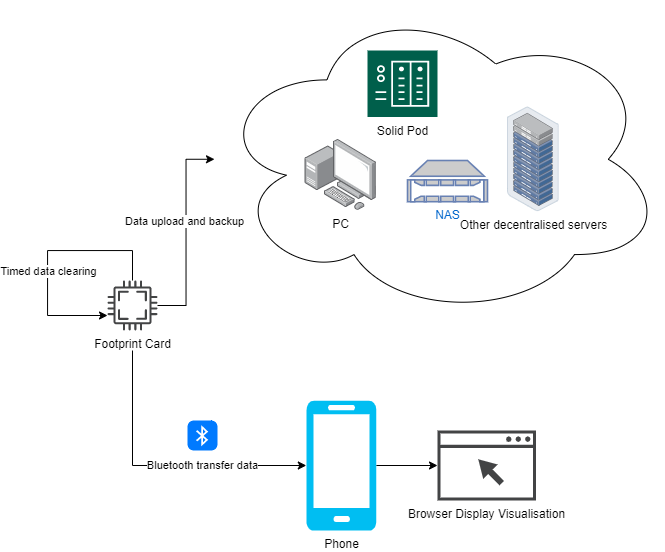

### SSM1: Problem definition
> The smart device needs to record the user's location coordinates at a high frequency and save them locally (or back them up every few days), and connect by Bluetooth on a mobile phone for data transfer to visualize the footprint of a web page in a browser.
#### Main people involved:
People who love to record or travel.
#### Challenges
- Efficient device for continuous recording of location information: apps for mobile phones take up a lot of power and memory while requiring apps to be on all the time, but apps are accidentally or automatically cleaned in the background.
- Secure storage and recall of data: the company or server side of the mobile app has a large amount of data about the user. Potential security.
#### System boundaries
- Users' activity space.
- The device calls the sensor every 5 seconds.
#### Important processes
- Record GPS information for a long period of time.
- Transmission of information via Bluetooth communication.
- Visualization of user's data.
- Data storage.
#### Technology can help overcome the problem
- Use Network Attached Storage (NAS) or some other decentralized server such as the [Solid](https://solidproject.org/about) project for data storage.
- Some series of [ESP](https://www.espressif.com/en/products/socs/esp32-c3) with low power and slim volume.

### SSM2: Problem Situation Expression
There are two main use cases that work as diagrams below.
#### Use case1: Location recording scene

The card regularly calls up GPS information and stores the data by detecting whether the user is moving or not.
#### Use case2: Data transfer & backup scene

Cards are privacy-secured through decentralized servers. Footprint visualization using Bluetooth on mobile phones.

